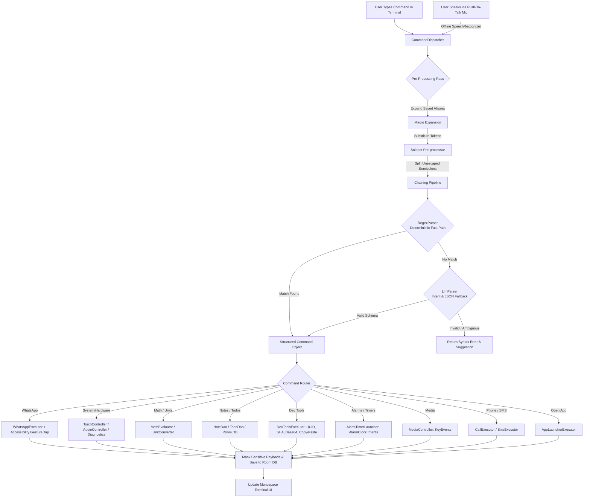
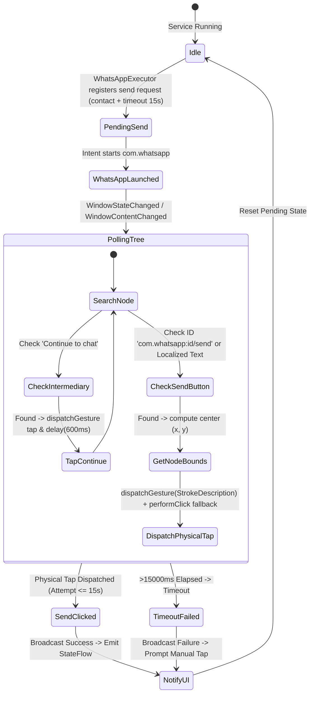

# 📱 NLCLI — Offline Natural-Language CLI Controller for Android

<p align="center">
  
  
  
  
  
  
  
  
</p>

---

## 📖 Table of Contents
1. [Executive Summary](#-executive-summary)
2. [Key Capabilities (v2.0 Expansion)](#-key-capabilities-v20-expansion)
3. [System Architecture](#-system-architecture)
   - [v2.0 Command Dispatch Pipeline](#v20-command-dispatch-pipeline)
   - [WhatsApp Gesture Automation State Machine](#whatsapp-gesture-automation-state-machine)
   - [Contact Fuzzy Resolution Engine](#contact-fuzzy-resolution-engine)
4. [Package & Module Structure](#-package--module-structure)
5. [Command Syntax & Comprehensive Cheat-Sheet](#-command-syntax--comprehensive-cheat-sheet)
6. [Security, Privacy & Permission Model](#-security-privacy--permission-model)
7. [Installation & Setup](#-installation--setup)
   - [Handling Google Play Protect](#handling-google-play-protect)
   - [Enabling Accessibility Service](#enabling-accessibility-service)
8. [Building from Source](#-building-from-source)
9. [Author & License](#-author--license)

---

## 🎯 Executive Summary

**NLCLI** is a high-performance native Android application engineered to provide a single, ultra-fast, terminal-style command bar where typing or speaking natural language instructions executes directly on the device with **zero cloud/internet dependencies**.

### Why Native Android + AccessibilityService + Direct Hardware Hooks?
1. **Sandboxing Limitations in CLI Tools (Termux)**: A traditional Linux CLI shell on Android cannot interact with third-party app UI hierarchies due to OS sandboxing.
2. **WhatsApp API Restrictions**: WhatsApp has no public intent for background message dispatching without user interaction.
3. **The Solution**: **NLCLI** pairs deterministic pattern matching with direct system services (`CameraManager`, `AudioManager`, `AlarmClock`, `Room DB`) and an Android `AccessibilityService` capable of coordinate-based synthetic physical touch injection (`dispatchGesture`) on the exact center coordinates of target action buttons.

---

## ✨ Key Capabilities (v2.0 Expansion)

- **⚡ Sub-Millisecond (<5ms) Parsing**: Deterministic compiled regex parser with fallback to structured JSON intent validation.
- **🎙️ Offline Push-To-Talk Voice Input**: Built-in on-device speech recognition via Android `SpeechRecognizer` (`EXTRA_PREFER_OFFLINE=true`) with animated mic toggle.
- **💬 100% Hands-Free WhatsApp Sending**: Automated chat loading, view hierarchy inspection (BFS), intermediary screen handling, and synthetic coordinate-based touch injection.
- **🔦 System Hardware & Sound Control**: Flashlight toggle (`torch on/off`), volume percentage (`volume 50`), mute, and sound profiles.
- **🔋 Diagnostics Suite**: Real-time battery diagnostics (level, charging state, temp, health), internal storage usage, and device hardware specs.
- **🔢 Inline Recursive-Descent Math Evaluator**: Fast arithmetic calculation supporting `+`, `-`, `*`, `/`, `^`, `%`, and nested parentheses without external runtime engines.
- **📏 Universal Unit Converter**: Standard conversions across temperature, distance, weight, speed, and digital storage.
- **📝 Persistent Local Notes & Todos**: Dedicated Room DB tables for creating notes (`note buy milk`) and managing task lists (`todo call doctor`, `todos`, `todo done 1`).
- **🛠️ Developer & Clipboard Tools**: UUID generator (`uuid`), SHA-256 (`sha256 text`), Base64 encode/decode, local IP inspection, and clipboard `copy`/`paste`.
- **⏰ Alarms, Timers & Clock Intents**: Fast alarm and timer scheduling (`alarm 7:00 am`, `timer 10 mins`).
- **🎵 Universal Media Controls**: Play, pause, next track, and previous track (`AudioManager` key dispatching).
- **🔁 Inline Chaining (`;`) & Persistent Macros (`alias`)**: Multi-command execution pipeline with accessibility busy gating (`alias gm = torch off; volume 100; open spotify`).
- **📌 Variable Snippets (`{token}`)**: Reusable text variables substituted before execution (e.g. `wa Rahul: pay {upi}`).
- **🛡️ Privacy by Default**: Message payloads masked in local database (`****`), unmasked logging prevented, and Android Cloud Auto-Backup disabled (`android:allowBackup="false"`).

---

## 🏛️ System Architecture

### v2.0 Command Dispatch Pipeline



---

### WhatsApp Gesture Automation State Machine



---

## 📂 Package & Module Structure

```
com.gintama.nlcli
├── 📂 accessibility/
│   ├── NLCliAccessibilityService.kt   # Background accessibility service with FIFO queue & dispatchGesture
│   └── NodeFinder.kt                  # BFS tree walker matching view-IDs, localized descriptions & bounds
├── 📂 clock/
│   └── AlarmTimerLauncher.kt          # System clock alarms and timers intent launcher
├── 📂 contacts/
│   ├── ContactResolver.kt             # ContactsContract lookup + Levenshtein fuzzy matcher + clean caching
│   ├── PhoneNormalizer.kt             # E.164 normalization (+91 defaults) & wa.me URL formatter
│   └── ResolvedContact.kt             # Contact data model
├── 📂 data/
│   ├── AppDatabase.kt                 # Room database configuration (v2 schema)
│   ├── dao/
│   │   ├── CommandHistoryDao.kt       # CRUD operations for command logs
│   │   ├── ContactCacheDao.kt         # CRUD operations for name-to-phone cache
│   │   ├── MacroDao.kt                # CRUD operations for persistent macros/aliases
│   │   ├── NoteDao.kt                 # CRUD operations for scratchpad notes
│   │   ├── SnippetDao.kt              # CRUD operations for token replacement snippets
│   │   └── TodoDao.kt                 # CRUD operations for task todo list
│   └── entity/
│       ├── CommandHistoryEntity.kt    # History table entity
│       ├── ContactCacheEntity.kt      # Contact cache entity
│       ├── MacroEntity.kt             # Macro/alias entity
│       ├── NoteEntity.kt              # Notes entity
│       ├── SnippetEntity.kt           # Snippet variable entity
│       └── TodoEntity.kt              # Todo tasks entity
├── 📂 dispatcher/
│   └── CommandDispatcher.kt           # Central orchestrator (macros -> snippets -> chaining -> parse -> execute)
├── 📂 executor/
│   ├── ICommandExecutor.kt            # Base executor interface
│   ├── WhatsAppExecutor.kt            # WhatsApp wa.me intent launcher with automation busy gating
│   ├── SmsExecutor.kt                 # SmsManager direct sender & intent fallback
│   ├── CallExecutor.kt                # ACTION_CALL & ACTION_DIAL executor
│   ├── AppLauncherExecutor.kt         # PackageManager fuzzy app search and launcher
│   └── SystemCommandExecutor.kt       # System controls, notes, todos, calc, dev tools, and diagnostics
├── 📂 media/
│   └── MediaController.kt             # Universal media playback key controller
├── 📂 model/
│   ├── Command.kt                     # Structured Command data class
│   ├── CommandType.kt                 # AppType, ActionType, ParseSource enums
│   ├── ExecutionResult.kt             # Execution result container
│   └── ParserResult.kt                # Sealed class for parser outcomes
├── 📂 parser/
│   ├── CommandParser.kt               # Parser interface
│   ├── RegexParser.kt                 # Full deterministic regex parser for v2.0 commands
│   └── LlmParser.kt                   # Schema-validated intent parser with safe JSONObject escaping
├── 📂 system/
│   ├── AudioController.kt             # Media volume and sound profiles (mute/silent/vibrate)
│   ├── DiagnosticsProvider.kt         # Battery, storage, and device hardware telemetry
│   └── TorchController.kt             # Flashlight controller via CameraManager
├── 📂 ui/
│   ├── CommandBarScreen.kt            # Main terminal UI screen with voice mic toggle & IME keyboard padding
│   ├── HistoryScreen.kt               # Searchable command history screen
│   ├── components/
│   │   ├── PermissionBanner.kt        # Amber accessibility, contact, and audio permission banner
│   │   ├── QuickActionChips.kt        # Quick action template buttons
│   │   ├── TerminalInputBar.kt        # Monospace input prompt (`>`) with Mic & history up/down
│   │   └── TerminalOutputView.kt      # Monospace log stream with syntax-highlighted badges
│   ├── theme/
│   │   ├── Color.kt                   # Warm graphite, copper, ivory, and coral palette
│   │   ├── Theme.kt                   # Compose Material3 Theme definition
│   │   └── Type.kt                    # Monospace + Serif typography styles
│   └── viewmodel/
│       ├── CliViewModel.kt            # Main CLI UI State, VoiceManager observer & command dispatcher
│       └── HistoryViewModel.kt        # History filter & search StateFlows
├── 📂 utility/
│   ├── DevToolsExecutor.kt            # UUID, SHA-256, Base64, Clipboard, and IP utilities
│   ├── MathEvaluator.kt               # Arithmetic evaluator (+, -, *, /, ^, %, parens)
│   └── UnitConverter.kt               # Distance, temp, weight, speed, and data unit converter
├── 📂 util/
│   ├── Logger.kt                      # Privacy-preserving disciplined logger with payload & phone masking
│   └── PermissionHelper.kt            # Accessibility, Audio & runtime permission helpers
├── 📂 voice/
│   └── VoiceInputManager.kt           # Offline push-to-talk speech recognition manager
├── MainActivity.kt                    # Single Activity container with Edge-to-Edge & Compose Navigation
└── NlCliApplication.kt                # Application entry point & Room eager init
```

---

## ⌨️ Command Syntax & Comprehensive Cheat-Sheet

| Category | Example Command | Description |
|---|---|---|
| **Voice Command** | Tap 🎙️ &rarr; *"Send whatsapp to Rahul: reaching in 10 mins"* | Auto-transcribes speech and executes command hands-free |
| **WhatsApp** | `send whatsapp to Rahul: reaching in 10 mins` | Resolves contact number, opens chat, auto-clicks Send |
| **WhatsApp (Short)** | `whatsapp Mom: reached home safely` | Short format with auto-send |
| **WhatsApp (Direct)** | `wa 9876543210 - I will call you later` | Direct phone number format |
| **Torch / Flashlight** | `torch on` / `flashlight off` / `toggle torch` | Direct camera flash hardware control |
| **Volume Control** | `volume 50` / `volume up` / `volume down` / `mute` | Sets media audio volume percentage |
| **Sound Profiles** | `silent mode` / `vibrate mode` | Sets ringer sound profile |
| **Diagnostics** | `battery` / `storage` / `device info` | Displays detailed charge %, temp, health, and storage |
| **Math Evaluator** | `calc (450 * 18) / 100` / `calc 2^10 + 50` | Sub-millisecond arithmetic evaluation |
| **Unit Converter** | `convert 5 miles to km` / `convert 100 f to c` | Instant unit conversions (temp, distance, weight) |
| **Notes (Room DB)** | `note buy milk and coffee` / `notes` / `notes clear` | Persists notes in dedicated local database |
| **Todos (Room DB)** | `todo call dentist` / `todos` / `todo done 1` | Manages local actionable task lists |
| **Dev Tools** | `uuid` / `sha256 mypassword` / `base64 hello` | Generates hashes, UUIDs, Base64, and copies to clipboard |
| **Clipboard** | `copy Important Token` / `paste` | Direct clipboard inspection and manipulation |
| **Local IP** | `ip` / `local ip` | Displays device local network IP address |
| **Alarms & Timers** | `alarm 7:00 am` / `timer 10 mins` / `show alarms` | Schedules clock alarms and timers |
| **Media Playback** | `play` / `pause` / `next song` / `prev` | Controls background music players |
| **Command Chaining** | `torch on; volume 50; open spotify` | Executes multiple commands sequentially in order |
| **Macros / Aliases** | `alias gm = torch off; volume 100; open spotify` | Creates persistent multi-command shortcuts |
| **Snippets** | `snippet upi = you@bank` &rarr; `wa Rahul: pay {upi}` | Reusable variable token substitution |
| **Phone Call** | `call Mom` / `call Rahul Sharma` | Dials contact directly |
| **SMS** | `send sms to Alex: check your email` | Sends SMS directly via SmsManager |
| **Open App** | `open YouTube` / `open Camera` / `open calc` | Launches app by name or common alias |
| **Dry Run** | `dryrun send whatsapp to Boss: done` | Evaluates command & prints execution plan without firing intents |
| **Diagnostics** | `status` | Displays service health, permissions, and database stats |
| **Help Guide** | `help` / `?` | Displays built-in commands reference |
| **Clear Screen** | `clear` / `cls` | Clears terminal screen output |

---

## 🛡️ Security, Privacy & Data Hygiene

1. **Masked Payloads in Database**: Both `rawInput` and `sanitizedPayload` columns in `CommandHistoryEntity` mask message text (`****`) by default so plaintext bodies are never readable from disk.
2. **Auto Backup Disabled**: `android:allowBackup="false"` is set in `AndroidManifest.xml` to prevent Android from backing up local database files to cloud backups.
3. **No Ambiguity Cache Poisoning**: `ContactResolver` guarantees that ambiguous match guesses are never cached automatically without confirmation.
4. **Tight Accessibility Scope**: The `accessibility_service_config.xml` is strictly scoped to `com.whatsapp` and `com.whatsapp.w4b` — it never inspects any other application.
5. **100% Offline Guarantee**: Zero external network or telemetry permissions (`android.permission.INTERNET` is **NOT** declared).

---

## 📲 Installation & Setup

### Handling Google Play Protect
When sideloading a developer APK containing Accessibility, SMS, and Contact permissions, Google Play Protect may display a prompt: *"Blocked by Play Protect / Unsafe app blocked"*.

To proceed:
1. Tap **"More details"** (small dropdown arrow).
2. Tap **"Install anyway"** (or *"Install anyway (unsafe)"*).

---

### Enabling Accessibility Service
For hands-free WhatsApp message dispatching:
1. Launch **NLCLI**.
2. Tap the **ENABLE** button on the amber banner.
3. In Android **Settings > Accessibility > Downloaded Apps**, select **NLCLI Automation Service**.
4. Toggle it **ON** and confirm **Allow**.
5. Grant Contacts and Audio permissions when prompted.

---

## 🔨 Building from Source

### Prerequisites
- **JDK 17** (e.g. Eclipse Adoptium Temurin 17)
- **Android SDK** (API Level 35, Build-Tools 34+)

### Run Unit Tests
```bash
./gradlew testDebugUnitTest
```

### Build Debug APK
```bash
./gradlew assembleDebug
```
The compiled APK will be generated at:
```
app/build/outputs/apk/debug/app-debug.apk
```

---

## 👤 Author & License

- **Author**: Sonu ([@gintama1018](https://github.com/gintama1018))
- **Email**: [Sonu.jangir2024@uem.edu.in](mailto:Sonu.jangir2024@uem.edu.in)
- **Repository**: [https://github.com/gintama1018/ANDROID-CLI-APPLICATION](https://github.com/gintama1018/ANDROID-CLI-APPLICATION)
- **Brand**: Silver Soul Studios / GINTAMA

*Licensed under the [MIT License](LICENSE).*
