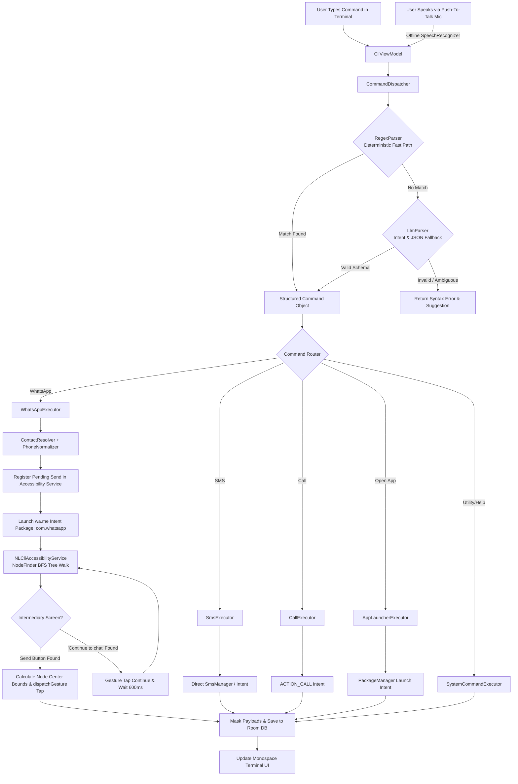
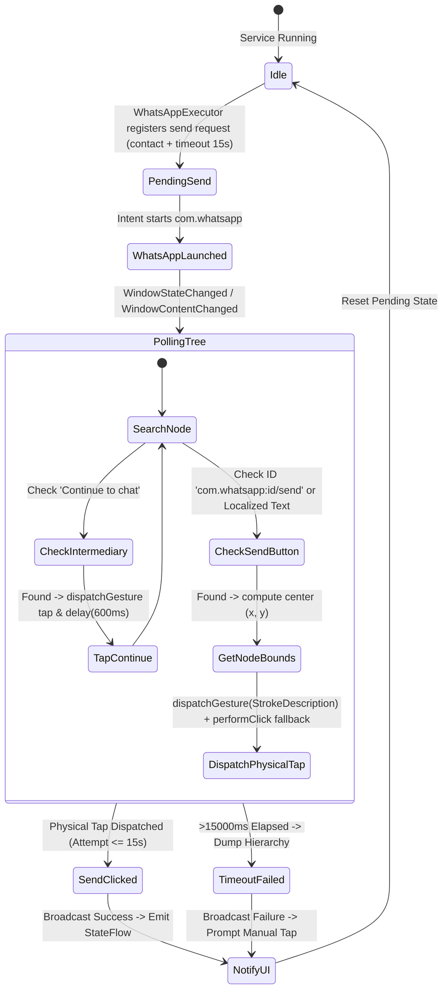
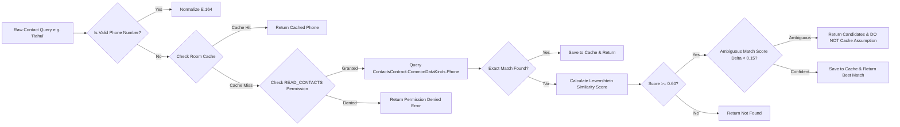

# 📱 NLCLI — Offline Natural-Language CLI Controller for Android

<p align="center">
  
  
  
  
  
  
  
</p>

---

## 📖 Table of Contents
1. [Executive Summary](#-executive-summary)
2. [Key Capabilities](#-key-capabilities)
3. [System Architecture](#-system-architecture)
   - [Command Dispatch Pipeline](#command-dispatch-pipeline)
   - [WhatsApp Gesture Automation State Machine](#whatsapp-gesture-automation-state-machine)
   - [Contact Fuzzy Resolution Engine](#contact-fuzzy-resolution-engine)
4. [Package & Module Structure](#-package--module-structure)
5. [Command Syntax & Cheat-Sheet](#-command-syntax--cheat-sheet)
6. [Security, Privacy & Permission Model](#-security-privacy--permission-model)
7. [Installation & Setup](#-installation--setup)
   - [Handling Google Play Protect](#handling-google-play-protect)
   - [Enabling Accessibility Service](#enabling-accessibility-service)
8. [Building from Source](#-building-from-source)
9. [Author & License](#-author--license)

---

## 🎯 Executive Summary

**NLCLI** is a native Android application engineered to provide a single, ultra-fast, terminal-style command bar where typing or speaking natural language instructions (such as *"send whatsapp to Rahul: reaching in 10 mins"*) executes them directly on the device with **zero cloud/internet dependencies**.

### Why Native Android + AccessibilityService + Gesture Taps?
1. **Sandboxing Limitations in CLI Tools (Termux)**: A traditional Linux CLI shell on Android cannot interact with third-party app UI hierarchies due to OS sandboxing.
2. **WhatsApp API Restrictions**: WhatsApp has no public intent for background message dispatching without user interaction.
3. **The Solution**: **NLCLI** generates targeted `wa.me` intents to prefill the chat window, coordinates with an Android `AccessibilityService` to inspect the UI tree (BFS), handles intermediary *"Continue to chat"* screens, and dispatches synthetic physical touch gestures (`dispatchGesture`) on the exact center coordinates of the Send button to bypass raw-touch event handlers.

---

## ✨ Key Capabilities

- **⚡ Sub-Millisecond (<5ms) Parsing**: Deterministic compiled regex parser with fallback to structured JSON intent validation.
- **🎙️ Offline Push-To-Talk Voice Input**: Built-in on-device speech recognition via Android `SpeechRecognizer` (`EXTRA_PREFER_OFFLINE=true`) with animated mic toggle.
- **💬 100% Hands-Free WhatsApp Sending**: Automated chat loading, view hierarchy inspection (BFS), intermediary screen handling, and synthetic coordinate-based touch injection.
- **📞 Instant Phone Calling**: Background direct dialing via `Intent.ACTION_CALL` or dialer fallback.
- **✉️ Direct SMS Messaging**: Direct background SMS dispatch via `SmsManager`.
- **🚀 Fuzzy App Launcher**: Fuzzy matching and package alias resolution (e.g. `open yt` &rarr; YouTube).
- **🧠 Levenshtein Fuzzy Contact Matching**: Resolves partial names and typos against `ContactsContract` with ambiguity protection and local Room DB caching.
- **🛡️ Privacy by Default**: Message payloads masked in local database (`****`) and Android Cloud Auto-Backup disabled (`android:allowBackup="false"`).
- **📜 Local Room Command History**: Searchable, persistent log with status filters (Success / Failed) and 1-tap re-execution.

---

## 🏛️ System Architecture

### Command Dispatch Pipeline



---

### WhatsApp Gesture Automation State Machine



---

### Contact Fuzzy Resolution Engine



---

## 📂 Package & Module Structure

```
com.gintama.nlcli
├── 📂 accessibility/
│   ├── NLCliAccessibilityService.kt   # Background accessibility service with dispatchGesture physical tap
│   └── NodeFinder.kt                  # BFS tree walker matching view-IDs, localized descriptions & bounds
├── 📂 contacts/
│   ├── ContactResolver.kt             # ContactsContract lookup + Levenshtein fuzzy matcher + clean caching
│   ├── PhoneNormalizer.kt             # E.164 normalization (+91 defaults) & wa.me URL formatter
│   └── ResolvedContact.kt             # Contact data model
├── 📂 data/
│   ├── AppDatabase.kt                 # Room database configuration
│   ├── dao/
│   │   ├── CommandHistoryDao.kt       # CRUD operations for command logs
│   │   └── ContactCacheDao.kt         # CRUD operations for name-to-phone cache
│   └── entity/
│       ├── CommandHistoryEntity.kt    # History table entity
│       └── ContactCacheEntity.kt      # Contact cache entity
├── 📂 dispatcher/
│   └── CommandDispatcher.kt           # Central orchestrator (parse -> resolve -> execute -> masked persist)
├── 📂 executor/
│   ├── ICommandExecutor.kt            # Base executor interface
│   ├── WhatsAppExecutor.kt            # WhatsApp wa.me intent launcher & accessibility hook
│   ├── SmsExecutor.kt                 # SmsManager direct sender & intent fallback
│   ├── CallExecutor.kt                # ACTION_CALL & ACTION_DIAL executor
│   ├── AppLauncherExecutor.kt         # PackageManager fuzzy app search and launcher
│   └── SystemCommandExecutor.kt       # Help, Status, Clear, Search, and DryRun handlers
├── 📂 model/
│   ├── Command.kt                     # Structured Command data class
│   ├── CommandType.kt                 # AppType, ActionType, ParseSource enums
│   ├── ExecutionResult.kt             # Execution result container
│   └── ParserResult.kt                # Sealed class for parser outcomes
├── 📂 parser/
│   ├── CommandParser.kt               # Parser interface
│   ├── RegexParser.kt                 # Fast-path deterministic regex parsing engine
│   └── LlmParser.kt                   # Schema-validated intent parser & fallback
├── 📂 ui/
│   ├── CommandBarScreen.kt            # Main terminal UI screen with voice mic toggle
│   ├── HistoryScreen.kt               # Searchable command history screen
│   ├── components/
│   │   ├── PermissionBanner.kt        # Amber accessibility, contact, and audio permission banner
│   │   ├── QuickActionChips.kt        # Quick action template buttons
│   │   ├── TerminalInputBar.kt        # Monospace input prompt (`>`) with Mic & history up/down
│   │   └── TerminalOutputView.kt      # Monospace log stream with syntax-highlighted badges
│   ├── theme/
│   │   ├── Color.kt                   # Dark theme palette (#0A0E14, #00FF66, #38BDF8)
│   │   ├── Theme.kt                   # Compose Material3 Theme definition
│   │   └── Type.kt                    # Monospace typography styles
│   └── viewmodel/
│       ├── CliViewModel.kt            # Main CLI UI State, VoiceManager observer & command dispatcher
│       └── HistoryViewModel.kt        # History filter & search StateFlows
├── 📂 util/
│   ├── Logger.kt                      # Privacy-preserving disciplined logger with payload masking
│   └── PermissionHelper.kt            # Accessibility, Audio & runtime permission helpers
├── 📂 voice/
│   └── VoiceInputManager.kt           # Offline push-to-talk speech recognition manager
├── MainActivity.kt                    # Single Activity container with Compose Navigation & permissions
└── NlCliApplication.kt                # Application entry point & Room eager init
```

---

## ⌨️ Command Syntax & Cheat-Sheet

| Category | Example Command | Description |
|---|---|---|
| **Voice Command** | Tap 🎙️ &rarr; *"Send whatsapp to Rahul: reaching in 10 mins"* | Auto-transcribes speech and executes command hands-free |
| **WhatsApp** | `send whatsapp to Rahul: reaching in 10 mins` | Resolves contact number, opens chat, auto-clicks Send |
| **WhatsApp (Short)** | `whatsapp Mom: reached home safely` | Short format with auto-send |
| **WhatsApp (Direct)** | `wa 9876543210 - I will call you later` | Direct phone number format |
| **Phone Call** | `call Mom` / `call Rahul Sharma` | Dials contact directly |
| **SMS** | `send sms to Alex: check your email` | Sends SMS directly via SmsManager |
| **Open App** | `open YouTube` / `open Camera` / `open calc` | Launches app by name or common alias |
| **Dry Run** | `dryrun send whatsapp to Boss: done` | Evaluates command & prints execution plan without firing intents |
| **Diagnostics** | `status` | Displays service health, permissions, and database stats |
| **Help Guide** | `help` / `?` | Displays built-in commands reference |
| **Clear Screen** | `clear` / `cls` | Clears terminal screen output |

---

## 🛡️ Security, Privacy & Data Hygiene

1. **Masked Payloads in Database**: Both `rawInput` and `sanitizedPayload` columns in `CommandHistoryEntity` mask message text (`****`) by default so plaintext bodies are never readable from disk.
2. **Auto Backup Disabled**: `android:allowBackup="false"` is set in `AndroidManifest.xml` to prevent Android from backing up local database files to cloud backups.
3. **No Ambiguity Cache Poisoning**: `ContactResolver` guarantees that ambiguous match guesses are never cached automatically without confirmation.
4. **Tight Accessibility Scope**: The `accessibility_service_config.xml` is strictly scoped to `com.whatsapp` and `com.whatsapp.w4b` — it never inspects any other application.
5. **100% Offline Guarantee**: Zero external network or telemetry permissions (`android.permission.INTERNET` is **NOT** declared).

---

## 📲 Installation & Setup

### Handling Google Play Protect
When sideloading a developer APK containing Accessibility, SMS, and Contact permissions, Google Play Protect may display a prompt: *"Blocked by Play Protect / Unsafe app blocked"*.

To proceed:
1. Tap **"More details"** (small dropdown arrow).
2. Tap **"Install anyway"** (or *"Install anyway (unsafe)"*).

---

### Enabling Accessibility Service
For hands-free WhatsApp message dispatching:
1. Launch **NLCLI**.
2. Tap the **ENABLE** button on the amber banner.
3. In Android **Settings > Accessibility > Downloaded Apps**, select **NLCLI Automation Service**.
4. Toggle it **ON** and confirm **Allow**.
5. Grant Contacts and Audio permissions when prompted.

---

## 🔨 Building from Source

### Prerequisites
- **JDK 17** (e.g. Eclipse Adoptium Temurin 17)
- **Android SDK** (API Level 35, Build-Tools 34+)

### Run Unit Tests
```bash
./gradlew testDebugUnitTest
```

### Build Debug APK
```bash
./gradlew assembleDebug
```
The compiled APK will be generated at:
```
app/build/outputs/apk/debug/app-debug.apk
```

### Install Directly via ADB
```bash
adb install -r app/build/outputs/apk/debug/app-debug.apk
```

---

## 👤 Author & License

- **Author**: Sonu ([@gintama1018](https://github.com/gintama1018))
- **Email**: [Sonu.jangir2024@uem.edu.in](mailto:Sonu.jangir2024@uem.edu.in)
- **Repository**: [https://github.com/gintama1018/ANDROID-CLI-APPLICATION](https://github.com/gintama1018/ANDROID-CLI-APPLICATION)
- **Brand**: Silver Soul Studios / GINTAMA

*Licensed under the [MIT License](LICENSE).*
